# Summary of 2_DecisionTree

[<< Go back](../README.md)

## Decision Tree
- **n_jobs**: -1
- **criterion**: gini
- **max_depth**: 3
- **num_class**: 4
- **explain_level**: 2

## Validation
 - **validation_type**: split
 - **train_ratio**: 0.75
 - **shuffle**: True
 - **stratify**: True

## Optimized metric
logloss

## Training time

12.6 seconds

### Metric details
|           |    Extreme |      Major |       Minor |   Moderate |   accuracy |   macro avg |   weighted avg |   logloss |
|:----------|-----------:|-----------:|------------:|-----------:|-----------:|------------:|---------------:|----------:|
| precision |   0.624113 |   0.54522  |    0.851328 |   0.599572 |   0.756671 |    0.655058 |       0.742191 |  0.591085 |
| recall    |   0.789238 |   0.652241 |    0.940907 |   0.301399 |   0.756671 |    0.670946 |       0.756671 |  0.591085 |
| f1-score  |   0.69703  |   0.593948 |    0.893879 |   0.401146 |   0.756671 |    0.646501 |       0.736552 |  0.591085 |
| support   | 223        | 647        | 2623        | 929        |   0.756671 | 4422        |    4422        |  0.591085 |

## Confusion matrix
|                     |   Predicted as Extreme |   Predicted as Major |   Predicted as Minor |   Predicted as Moderate |
|:--------------------|-----------------------:|---------------------:|---------------------:|------------------------:|
| Labeled as Extreme  |                    176 |                   43 |                    4 |                       0 |
| Labeled as Major    |                     88 |                  422 |                   53 |                      84 |
| Labeled as Minor    |                      2 |                   50 |                 2468 |                     103 |
| Labeled as Moderate |                     16 |                  259 |                  374 |                     280 |

## Learning curves

## Permutation-based Importance
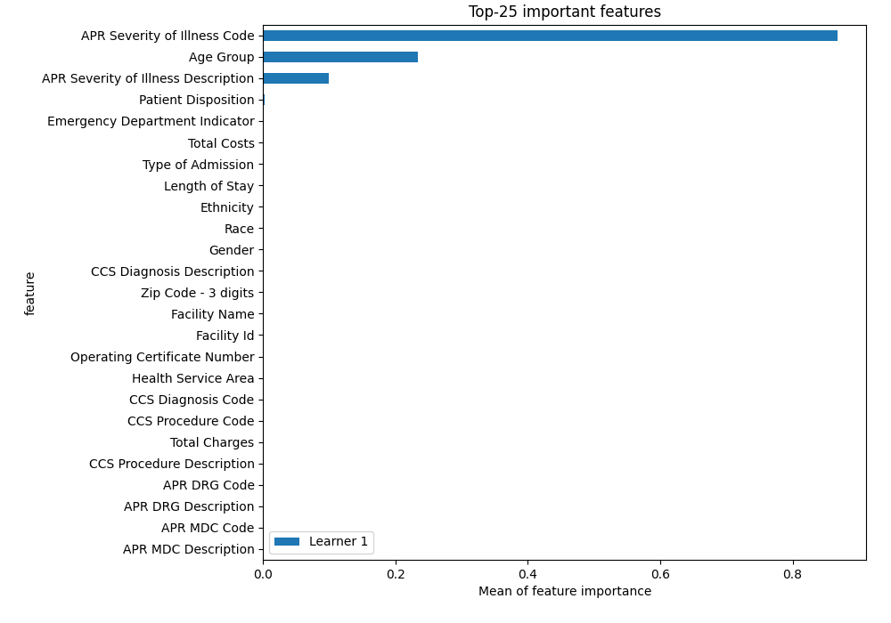
## Confusion Matrix

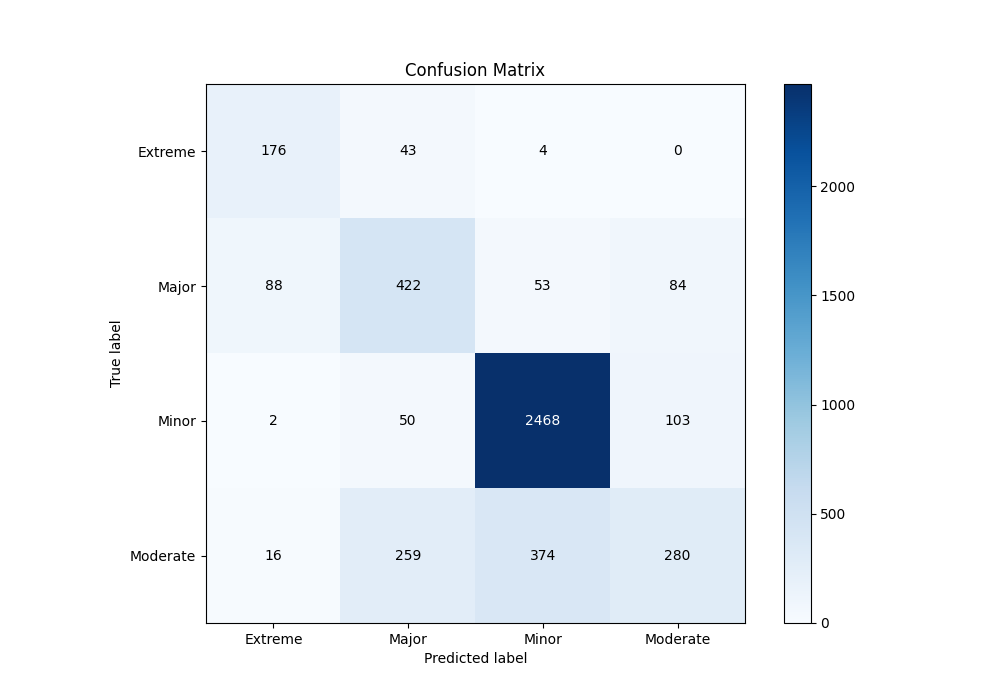

## Normalized Confusion Matrix

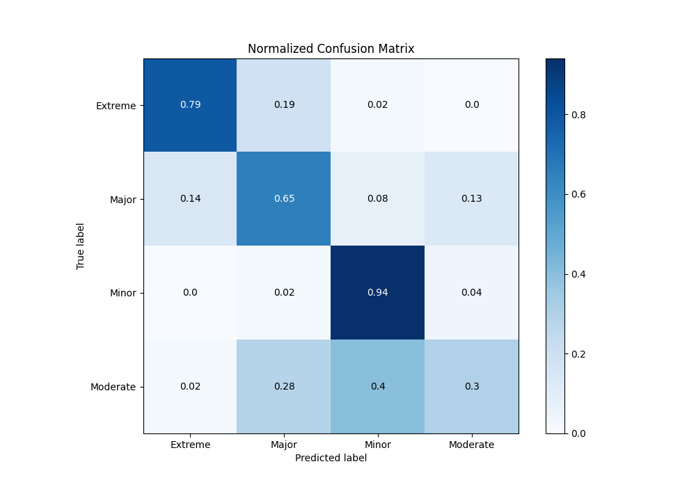

## ROC Curve

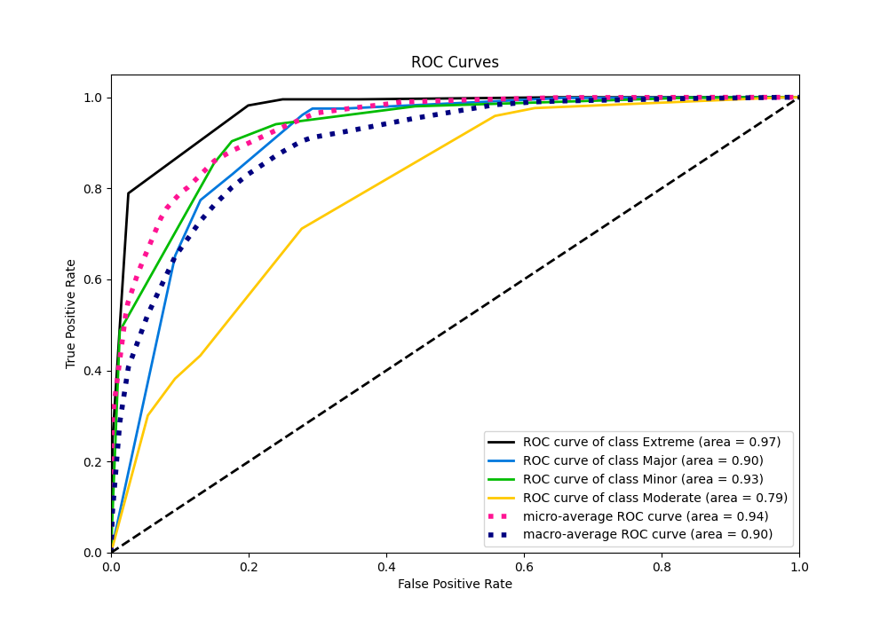

## Precision Recall Curve

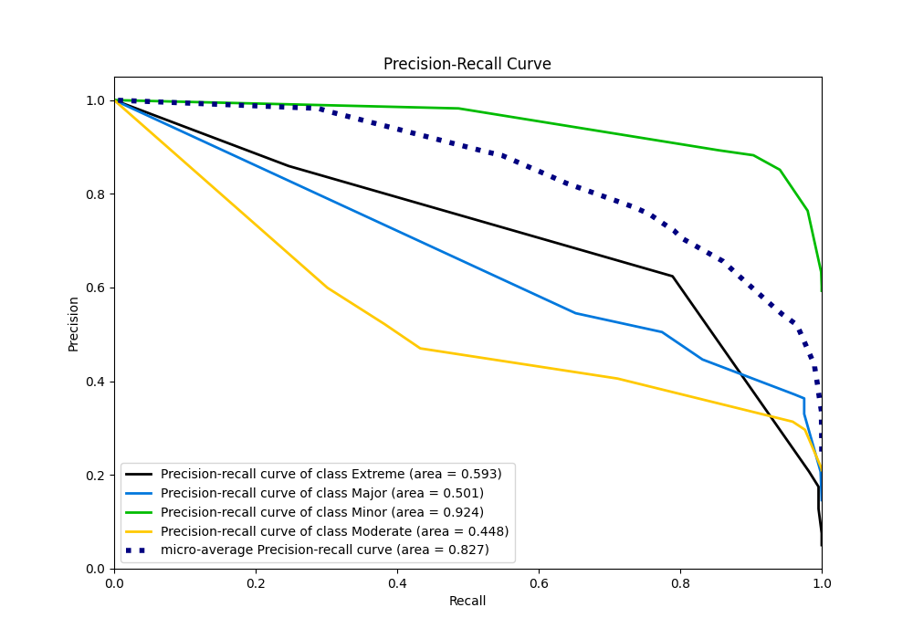

## SHAP Importance
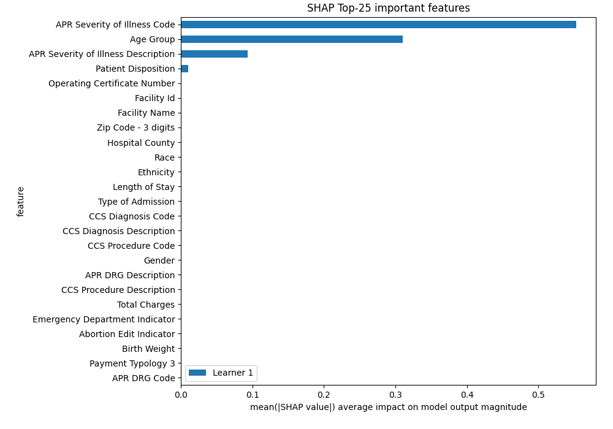

## SHAP Dependence plots

### Dependence Extreme (Fold 1)
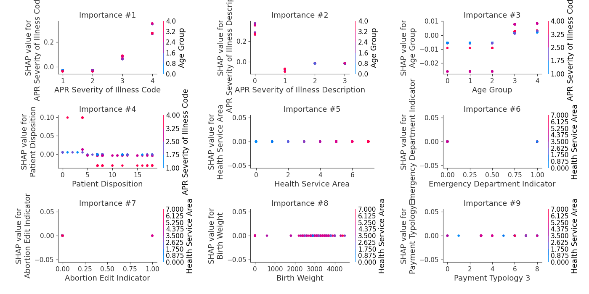
### Dependence Major (Fold 1)
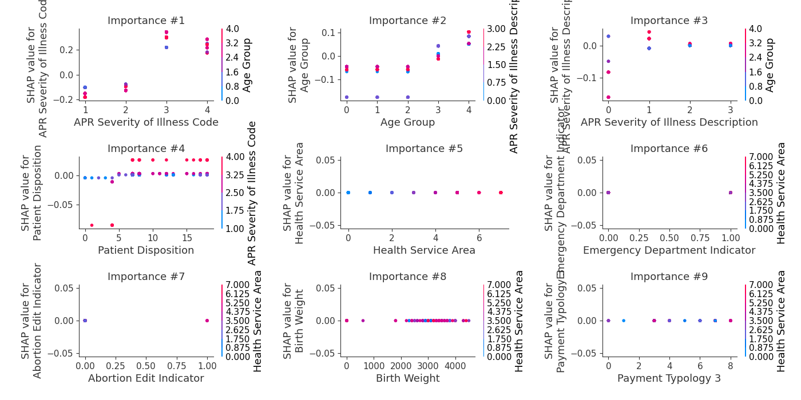
### Dependence Minor (Fold 1)
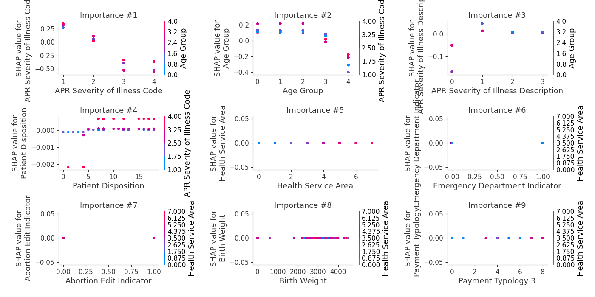
### Dependence Moderate (Fold 1)
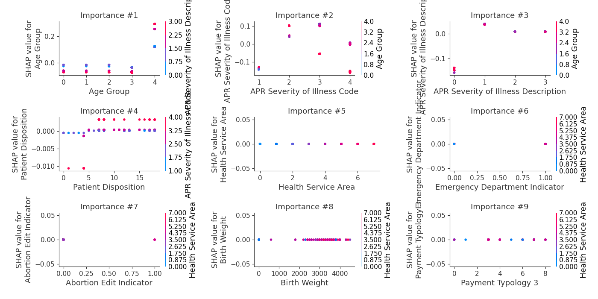

## SHAP Decision plots

### Worst decisions for selected sample 1 (Fold 1)
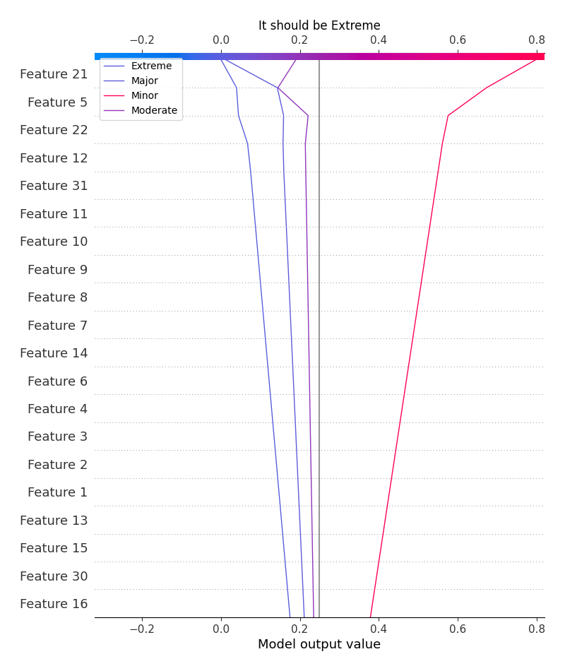
### Worst decisions for selected sample 2 (Fold 1)

### Worst decisions for selected sample 3 (Fold 1)
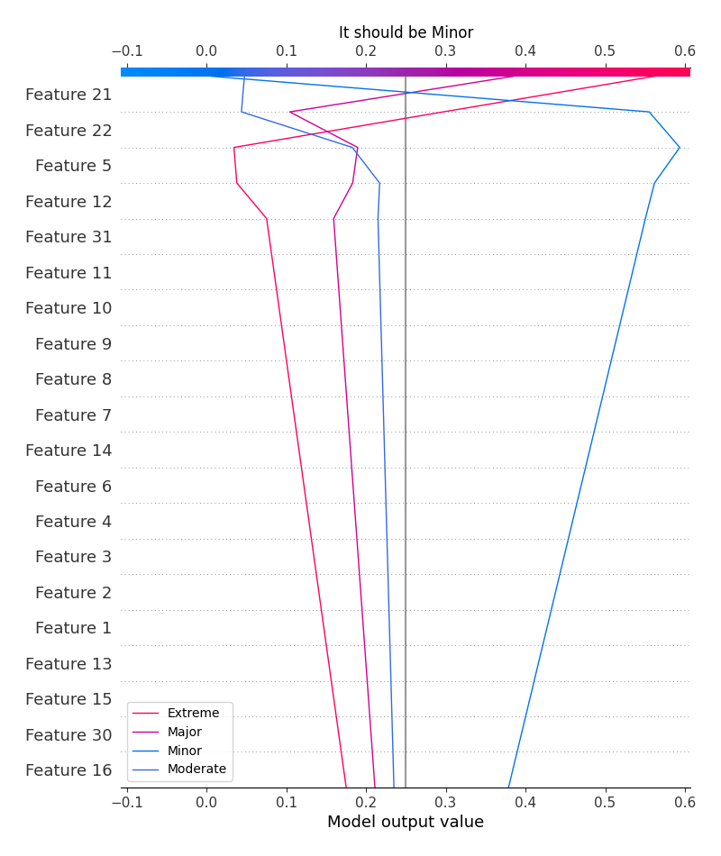
### Worst decisions for selected sample 4 (Fold 1)

### Best decisions for selected sample 1 (Fold 1)

### Best decisions for selected sample 2 (Fold 1)
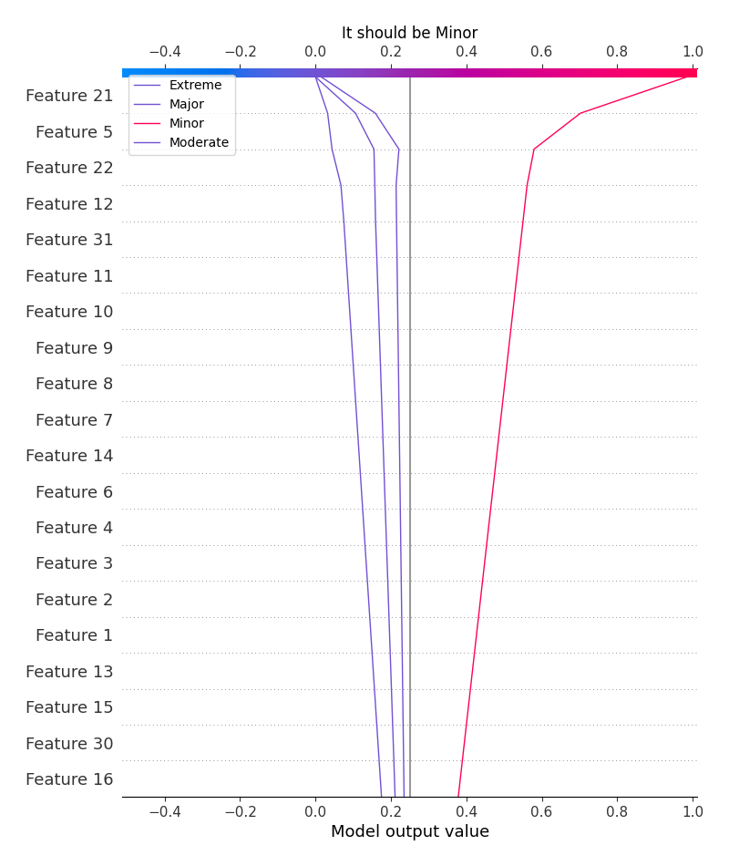
### Best decisions for selected sample 3 (Fold 1)

### Best decisions for selected sample 4 (Fold 1)

[<< Go back](../README.md)
