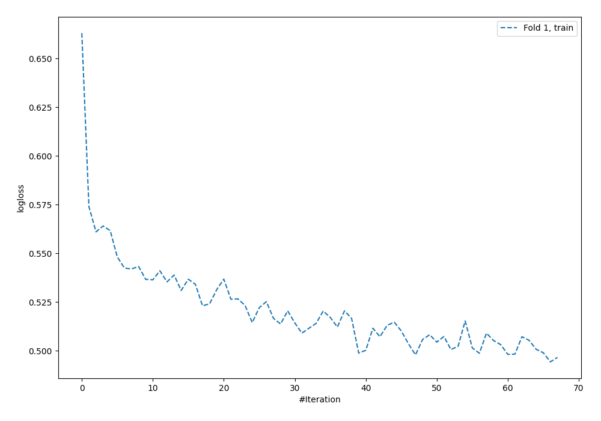
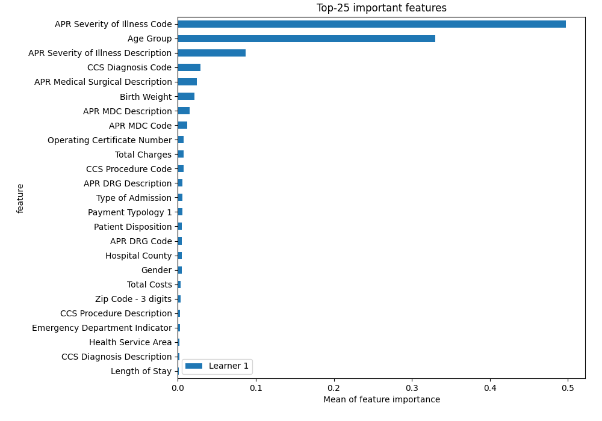
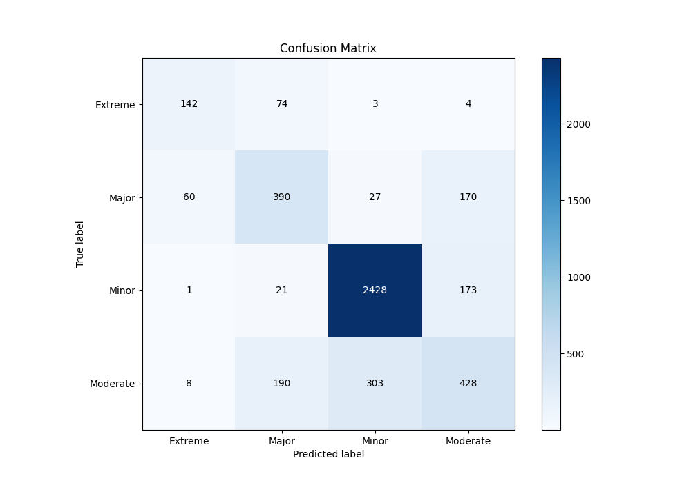
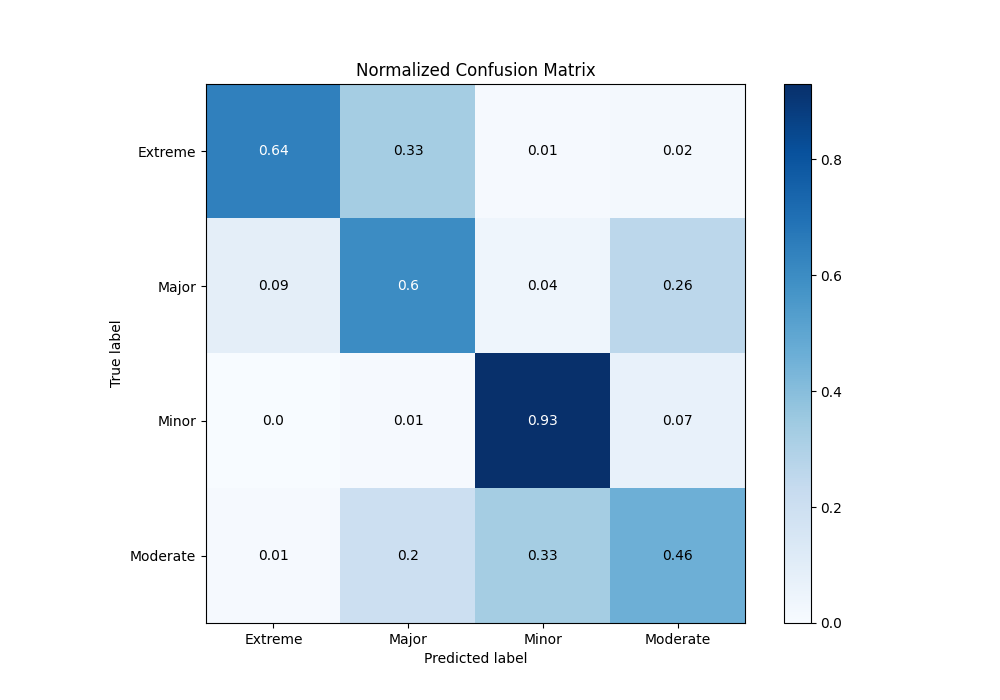
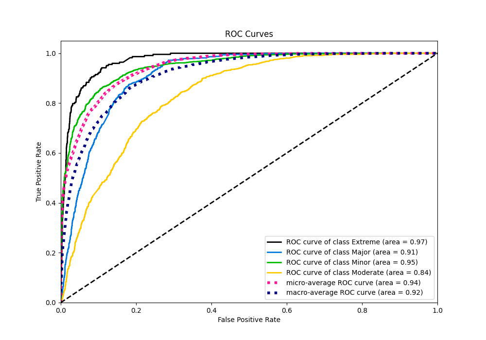
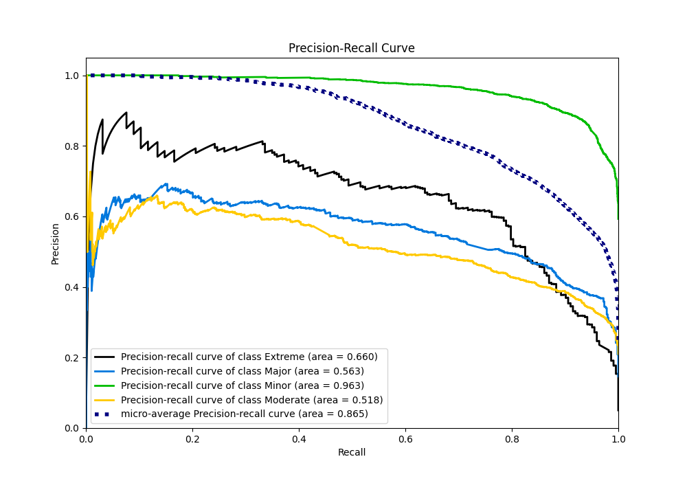

# Summary of 4_Default_NeuralNetwork

[<< Go back](../README.md)

## Neural Network
- **n_jobs**: -1
- **dense_1_size**: 32
- **dense_2_size**: 16
- **learning_rate**: 0.05
- **num_class**: 4
- **explain_level**: 2

## Validation
 - **validation_type**: split
 - **train_ratio**: 0.75
 - **shuffle**: True
 - **stratify**: True

## Optimized metric
logloss

## Training time

4.1 seconds

### Metric details
|           |    Extreme |      Major |       Minor |   Moderate |   accuracy |   macro avg |   weighted avg |   logloss |
|:----------|-----------:|-----------:|------------:|-----------:|-----------:|------------:|---------------:|----------:|
| precision |   0.672986 |   0.577778 |    0.879392 |   0.552258 |   0.766169 |    0.670603 |       0.756126 |  0.565377 |
| recall    |   0.636771 |   0.602782 |    0.925658 |   0.46071  |   0.766169 |    0.65648  |       0.766169 |  0.565377 |
| f1-score  |   0.654378 |   0.590015 |    0.901932 |   0.502347 |   0.766169 |    0.662168 |       0.759863 |  0.565377 |
| support   | 223        | 647        | 2623        | 929        |   0.766169 | 4422        |    4422        |  0.565377 |

## Confusion matrix
|                     |   Predicted as Extreme |   Predicted as Major |   Predicted as Minor |   Predicted as Moderate |
|:--------------------|-----------------------:|---------------------:|---------------------:|------------------------:|
| Labeled as Extreme  |                    142 |                   74 |                    3 |                       4 |
| Labeled as Major    |                     60 |                  390 |                   27 |                     170 |
| Labeled as Minor    |                      1 |                   21 |                 2428 |                     173 |
| Labeled as Moderate |                      8 |                  190 |                  303 |                     428 |

## Learning curves

## Permutation-based Importance

## Confusion Matrix

## Normalized Confusion Matrix

## ROC Curve

## Precision Recall Curve

[<< Go back](../README.md)
