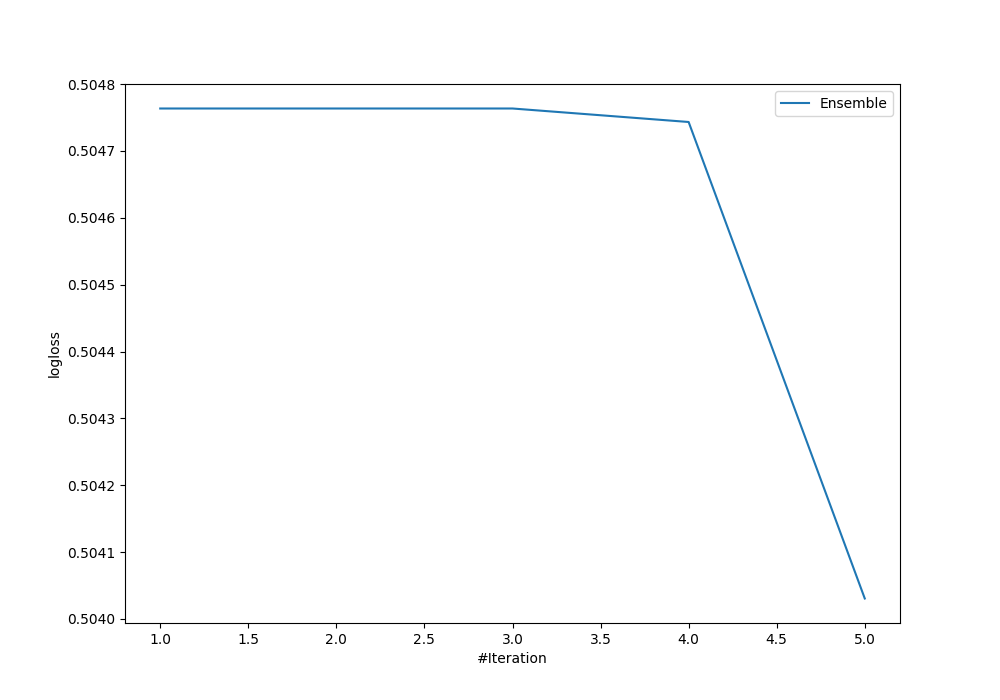
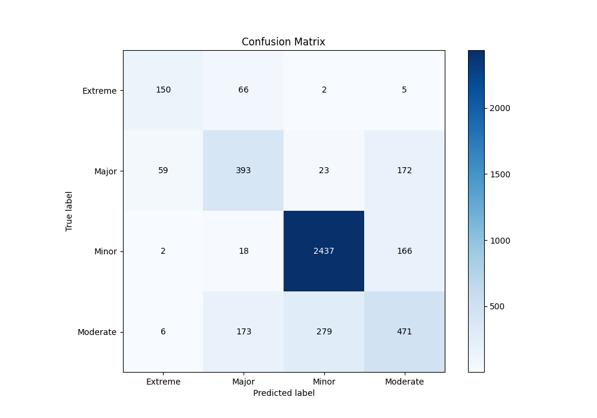
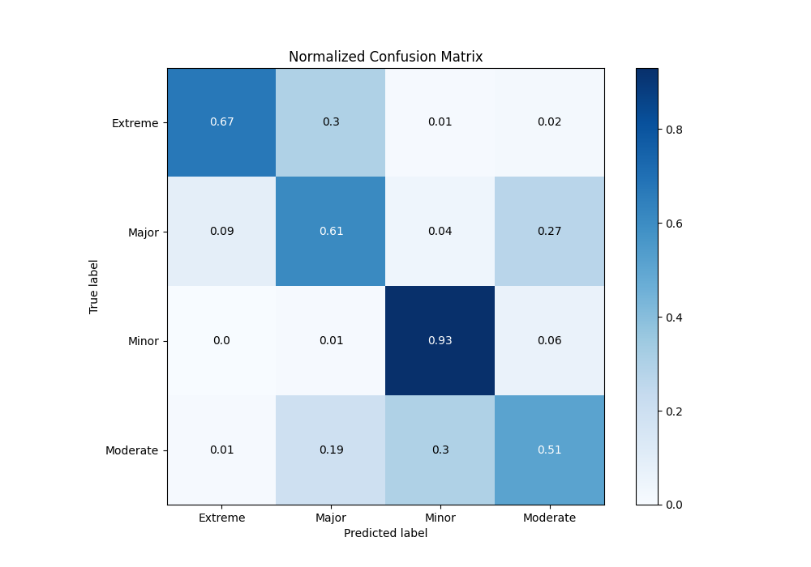
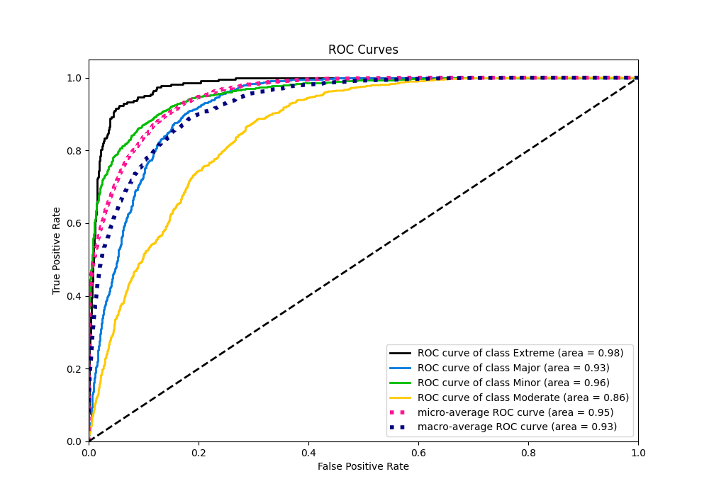
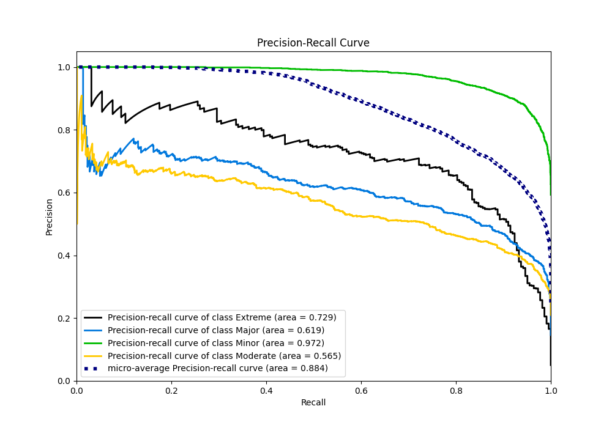

# Summary of Ensemble

[<< Go back](../README.md)

## Ensemble structure
| Model                   |   Weight |
|:------------------------|---------:|
| 3_Default_Xgboost       |        4 |
| 4_Default_NeuralNetwork |        1 |

### Metric details
|           |    Extreme |      Major |       Minor |   Moderate |   accuracy |   macro avg |   weighted avg |   logloss |
|:----------|-----------:|-----------:|------------:|-----------:|-----------:|------------:|---------------:|----------:|
| precision |   0.691244 |   0.604615 |    0.889092 |   0.578624 |   0.780416 |    0.690894 |       0.772267 |   0.50403 |
| recall    |   0.672646 |   0.607419 |    0.929089 |   0.506997 |   0.780416 |    0.679038 |       0.780416 |   0.50403 |
| f1-score  |   0.681818 |   0.606014 |    0.90865  |   0.540448 |   0.780416 |    0.684232 |       0.775577 |   0.50403 |
| support   | 223        | 647        | 2623        | 929        |   0.780416 | 4422        |    4422        |   0.50403 |

## Confusion matrix
|                     |   Predicted as Extreme |   Predicted as Major |   Predicted as Minor |   Predicted as Moderate |
|:--------------------|-----------------------:|---------------------:|---------------------:|------------------------:|
| Labeled as Extreme  |                    150 |                   66 |                    2 |                       5 |
| Labeled as Major    |                     59 |                  393 |                   23 |                     172 |
| Labeled as Minor    |                      2 |                   18 |                 2437 |                     166 |
| Labeled as Moderate |                      6 |                  173 |                  279 |                     471 |

## Learning curves

## Confusion Matrix

## Normalized Confusion Matrix

## ROC Curve

## Precision Recall Curve

[<< Go back](../README.md)
