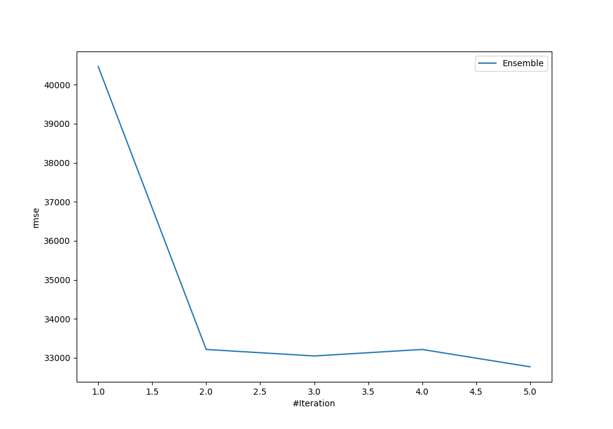
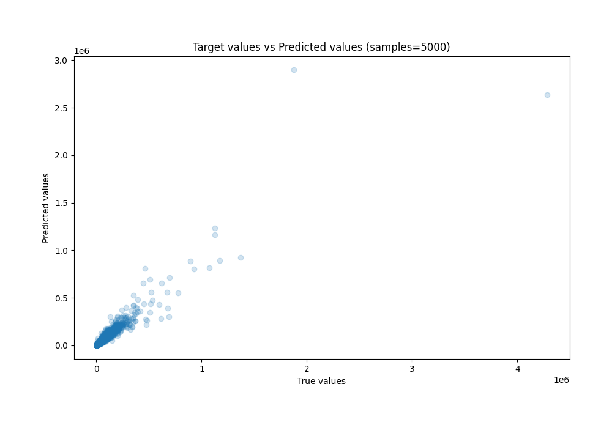
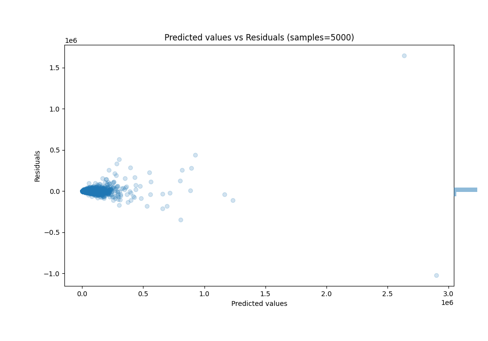

# Summary of Ensemble

[<< Go back](../README.md)

## Ensemble structure
| Model                   |   Weight |
|:------------------------|---------:|
| 3_Default_Xgboost       |        2 |
| 4_Default_NeuralNetwork |        3 |

### Metric details:
| Metric   |           Score |
|:---------|----------------:|
| MAE      |  8275.53        |
| MSE      |     1.07393e+09 |
| RMSE     | 32770.9         |
| R2       |     0.873468    |
| MAPE     |     0.181971    |

## Learning curves

## True vs Predicted

## Predicted vs Residuals

[<< Go back](../README.md)
